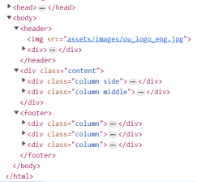

1. copy main.txt into a new html file

.

2. style the header 

   to fix header at the top of the window, add following css rules in the header section of the css file

   ```
    top: 0px;
    height: 90px;
    position: fixed;
    ```

3. Float links to the right

    ```
    header div {
        float: right;
        ...
    }
    ```

4. Delete all border elements form header

    ```
    border-color, border-style, border-width
    ```

5. Change the header's height

    ```
    height: 55px;
    ```

6. Give spaces before content of the page. Add following css class definition:

    ```
    .content {
        padding-top: 55px;
    }
    ```

7. Let format content section. **Side** section should use 20% and **middle** section should use 80% of screen. Create two unequal columns that floats next to each other

    ```
    .column {
        float: left;
        padding: 10px;
        ...
    }
    ```

    ```
    /* Left column */
    .column.side {
        width: 20%;
    }
    /* Middle column */
    .column.middle {
        width: 80%;
    }
    ```
8. Delete all border properties from the **.column** class

    ```
    border-color: aqua;
    border-style: solid;
    border-width: 5px;
    ```

9.  Add following css definition

    ```
    footer div {
        width: 30%;
        border-color: red;
        border-style: solid;
        margin: 10px;
    }
    ```

10.  Delete list item's marker

    ```
    footer div ul {
        list-style-type: none;
    }
    ```
11. Update footer css rules

    ```
    footer {
        ...
        clear:both;
        width: 100%;
        height: 230px;
    }
    ```

12. Delete all border rules from **footer**

    ```
    border-color: blue;
    border-style: solid;
    border-style: solid;
    border-width: 3px;
    ```

13. Delete all border rules from **footer div**
    ```
    border-color: red;
    border-style: solid;
    ```

14. Complete version of css file

    ```
    * {
        box-sizing: border-box;
    }

    body {
        margin: 0;
    }

    /* Style the header */
    header {
        width: 100%;
        top: 0px;
        height: 55px;
        position: fixed;
        padding: 3px;
        overflow: hidden;
        background-color: #A30050;
    }

    /* Style the menu links */
    header div {
        float: right;
    }

    header div a {
        /*float: left;*/
        color: #f2f2f2;
        text-align: center;
        padding: 14px 16px;
        text-decoration: none;
        font-family: 'Roboto', sans-serif;
        font-size: 18px;
    }

    /* Change color on hover */
    header a:hover {
        background-color: #ddd;
        color: black;
    }

    .content {
        padding-top: 55px;
    }

    /* Create two unequal columns that floats next to each other */
    .column {
        float: left;
        padding: 10px;
    }

    /* Left column */
    .column.side {
        width: 20%;
    }
    /* Middle column */
    .column.middle {
        width: 80%;
    }

    .content ul li {
        list-style-type: square;
        margin: 0;
        padding: 0;
    }

    footer {
        color:black;
        background-color:#ddd;
        border-style: solid;
        padding:3px;
        margin: 0;
        clear:both;
        width: 100%;
        height: 230px;
    }

    footer div {
        width: 30%;
        margin: 10px;
    }


    footer div ul {
        list-style-type: none;
    }
    ```